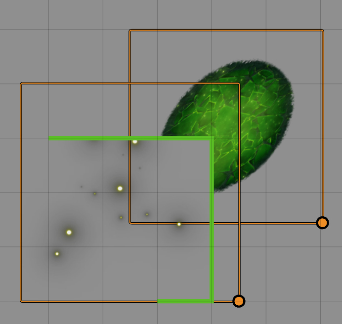

# Tile Mask

## Description

This module adds an option titled `Walls masks tile` in the UI when configuring tiles. Checking this option causes the tile to be masked by the walls surrounding it.

## Download

`https://github.com/Haxxer/FoundryVTT-TileMask/releases/latest/download/module.json`

## Known Issues

### Tile Placement

If a tile is placed exactly on a wall, the tile is not masked. This is because if shares the same position as a wall, it cannot figure out which side to mask.  

### Incompatibility with Perfect Vision

Due to how Perfect Vision modifies the entirety of the canvas, Tile Mask is not compatible with Perfect Vision. This is sadly not on Tile Mask's side, as I cannot change how Perfect vision is set up.

## Special Thanks

Many thanks to theripper93, as he continues to be an invaluable addition to our community. 